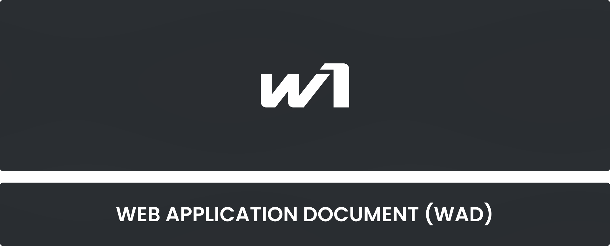
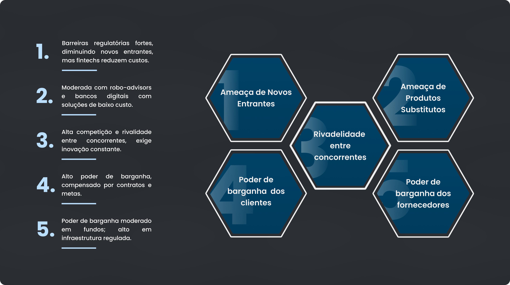
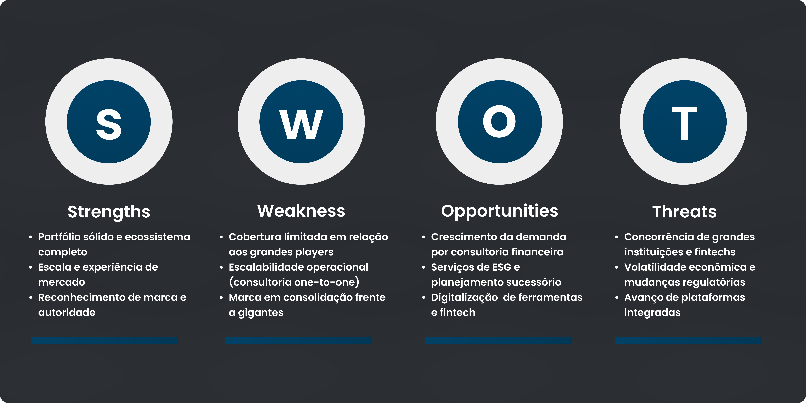
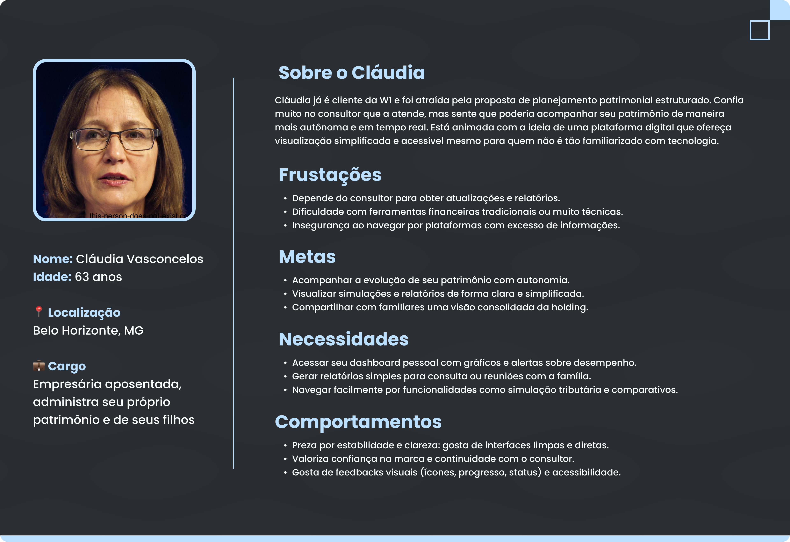
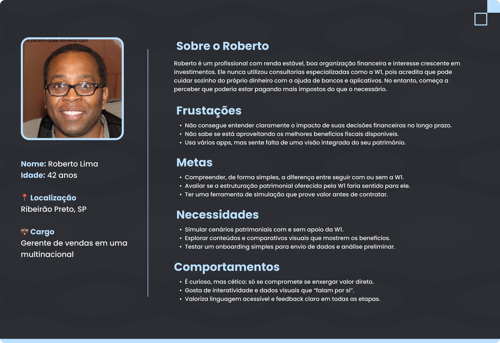

<table align="center" style="border: none; border-collapse: collapse;">
  <tr>
    <td style="border: none;"></td>
    <td style="border: none; padding: 1;"></td>
    <td style="border: none; padding: 1;"></td>
  </tr>
</table>

# Sumário

[1. Introdução](#c1)

[2. Visão Geral da Aplicação Web](#c2)

[3. Projeto Técnico da Aplicação Web](#c3)

[4. Desenvolvimento da Aplicação Web](#c4)

[5. Testes da Aplicação Web](#c5)

[6. Estudo de Mercado e Plano de Marketing](#c6)

[7. Conclusões e trabalhos futuros](#c7)

[8. Referências](c#8)

[Anexos](#c9)

 

# 1. Introdução

Os clientes da W1 Consultoria Patrimonial enfrentam hoje a falta de uma plataforma digital integrada para acompanhar seus patrimônios e participar ativamente do processo de criação de holdings. Sem um ambiente online, todo o fluxo — desde a simulação de economia tributária até o monitoramento de ativos como imóveis — é conduzido de forma manual, gerando baixa transparência e dificultando a tomada de decisão, especialmente para o público sênior, menos adaptado a soluções complexas.

Para resolver esse gap, desenvolvemos um WebApp responsivo e acessível, pensado para adultos e idosos. A solução contempla:

* **Dashboard em tempo real**: gráficos de evolução de patrimônio, comparativos de performance com e sem W1 e valores de mercado atualizados via API financeira.
* **Simuladores interativos**: formulário para projeção de economia tributária e infográficos educativos que explicam, de forma visual, os benefícios de estruturar holdings.
* **Onboarding gamificado e tutorial passo a passo**: quiz de perfil e tour interativo que apresentam as principais abas e funcionalidades.
* **Recursos de acessibilidade**: compatibilidade com leitores de tela, navegação por teclado e modo de alto contraste, garantindo inclusão total.

Os aspectos essenciais de criação de valor foram a simplicidade de uso — com hierarquia clara de informações —, a personalização de relatórios conforme o perfil do cliente e a atualização contínua de dados, que promovem autonomia e confiança. Essa solução está alinhada às expectativas da W1, pois une inovação, usabilidade e impacto real na experiência do cliente, potencializando o crescimento do negócio.

# 2. Visão Geral da Aplicação Web (sprint 1)

## 2.1. Escopo do Projeto

### 2.1.1. Modelo de 5 Forças de Porter

O Modelo das 5 Forças de Porter é uma ferramenta estratégica fundamental que nos permite analisar o ambiente competitivo da W1 Consultoria Patrimonial no setor de gestão patrimonial. Desenvolvido por Michael Porter, este framework avalia cinco dimensões críticas: rivalidade entre concorrentes, poder de barganha dos fornecedores, poder de barganha dos clientes, ameaça de novos entrantes e ameaça de produtos substitutos.

Através desta análise, podemos compreender melhor as pressões competitivas enfrentadas pela W1 e identificar oportunidades estratégicas para fortalecer sua posição no mercado. A seguir, apresentamos o diagrama detalhado das 5 Forças de Porter aplicado ao contexto da W1:

  
5 Forças de Porter aplicadas à W1 Consultoria Patrimonial

  
  
Figura 1: As 5 Forças de Porter. Fonte: Elaborado pelos autores (2025)

O diagrama acima ilustra como cada força impacta o posicionamento estratégico da W1 no mercado de consultoria patrimonial, fornecendo insights valiosos para a definição de estratégias competitivas eficazes.

### 2.1.2. Análise SWOT da Instituição Parceira

A Análise SWOT é uma ferramenta estratégica que permite avaliar os ambientes interno e externo de uma organização através de quatro perspectivas: Forças (Strengths), Fraquezas (Weaknesses), Oportunidades (Opportunities) e Ameaças (Threats). Para a W1 Consultoria Patrimonial, esta análise revela insights valiosos sobre sua posição competitiva e potenciais direções estratégicas.

  
Análise SWOT da W1 Consultoria Patrimonial

  
  
Figura 2: Análise SWOT. Fonte: Elaborado pelos autores (2025)

A matriz acima evidencia os principais aspectos identificados em cada quadrante, demonstrando como a W1 pode alavancar suas forças e oportunidades enquanto trabalha para mitigar fraquezas e se proteger contra ameaças do mercado.

### 2.1.3. Solução

*Explique detalhadamente os seguintes aspectos (até 60 palavras por item):*
1. Problema a ser resolvido
2. Dados disponíveis (mencionar fonte e conteúdo; se não houver, indicar “não se aplica”)
3. Solução proposta
4. Forma de utilização da solução
5. Benefícios esperados
6. Critério de sucesso e como será avaliado

### 2.1.4. Value Proposition Canvas
O Value Proposition Canvas é uma ferramenta estratégica que nos ajuda a entender profundamente a relação entre as necessidades do cliente e a proposta de valor do produto. Este framework, desenvolvido por Alexander Osterwalder, é dividido em dois principais componentes: o Perfil do Cliente e o Mapa de Valor.

No contexto da W1 Consultoria Patrimonial, o canvas foi desenvolvido focando nas dores e necessidades específicas dos clientes que buscam gestão patrimonial eficiente, demonstrando como nossa solução digital endereça esses pontos de forma efetiva.

  
Value Proposition Canvas da W1 Consultoria Patrimonial

  
  
Figura 3: Value Proposition Canvas. Fonte: Elaborado pelos autores (2025)

O canvas acima demonstra o alinhamento entre as necessidades identificadas em nosso público-alvo e as soluções oferecidas pela plataforma, evidenciando como cada funcionalidade foi pensada para resolver dores específicas e gerar ganhos tangíveis para os usuários.

## 2.2. Personas

As Personas são representações fictícias dos usuários ideais do produto, baseadas em dados reais e pesquisas de mercado. Elas ajudam a equipe de desenvolvimento a entender melhor as necessidades, comportamentos, dores e motivações dos usuários finais. Para o projeto da W1 Consultoria Patrimonial, foram desenvolvidas duas personas principais que representam diferentes perfis de clientes potenciais, considerando aspectos como idade, familiaridade com tecnologia, objetivos financeiros e necessidades específicas em relação à gestão patrimonial.

A seguir, apresentamos as personas desenvolvidas para este projeto:

  
Persona 1

  
  
Figura 4: Persona 1. Fonte: Elaborado pelos autores (2025)

  
Persona 2

  
  
Figura 5: Persona 2. Fonte: Elaborado pelos autores (2025)

## 2.3. User Stories
*Posicione aqui a lista de User Stories levantadas para o projeto. Siga o template de User Stories e utilize a mesma referência USXX no roadmap de seu quadro Kanban. Indique todas as User Stories mapeadas, mesmo aquelas que não forem implementadas ao longo do projeto. Não se esqueça de explicar o INVEST das 5 User Stories prioritárias*

*ATUALIZE ESTA SEÇÃO SEMPRE QUE ALGUMA DEMANDA MUDAR EM SEU PROJETO*

*Template de User Story*
Identificação | USXX (troque XX por numeração ordenada das User Stories)
--- | ---
Persona | nome da Persona
User Story | "como (papel/perfil), posso (ação/meta), para (benefício/razão)"
Critério de aceite 1 | CR1: descrever cenário + testes de aceite
Critério de aceite 2 | CR2: descrever cenário + testes de aceite
Critério de aceite ... | CR...
Critérios INVEST | *(Por que é Independente? Por que é Negociável? Por que é Valorosa? Por que é Estimável? Por que é Pequena? Por que é Testável?)*

# 3. Projeto da Aplicação Web

## 3.1. Wireframes

*Posicione aqui as imagens do wireframe construído para sua solução e, opcionalmente, o link para acesso (mantenha o link sempre público para visualização)*

## 3.2. Guia de estilos

*Descreva aqui orientações gerais para o leitor sobre como utilizar os componentes do guia de estilos de sua solução*

### 3.2.1 Cores

*Apresente aqui a paleta de cores, com seus códigos de aplicação e suas respectivas funções*

### 3.2.2 Tipografia

*Apresente aqui a tipografia da solução, com famílias de fontes e suas respectivas funções*

### 3.2.3 Iconografia e imagens 

*(esta subseção é opcional, caso não existam ícones e imagens, apague esta subseção)*

*posicione aqui imagens e textos contendo exemplos padronizados de ícones e imagens, com seus respectivos atributos de aplicação, utilizadas na solução*

## 3.3 Protótipo de alta fidelidade

*posicione aqui algumas imagens demonstrativas de seu protótipo de alta fidelidade e o link para acesso ao protótipo completo (mantenha o link sempre público para visualização)*

## 3.4. Modelagem do banco de dados

### 3.4.1. Modelo relacional

*posicione aqui os diagramas de modelos relacionais do seu banco de dados, apresentando todos os esquemas de tabelas e suas relações. Utilize texto para complementar suas explicações, se necessário*

# 4. Desenvolvimento da Aplicação Web

## 4.1. vamo ver qq vai ter aqui

# 6. Estudo de Mercado

## 6.1 Resumo Executivo

*Preencher com até 300 palavras, sem necessidade de fonte*

*Apresente de forma clara e objetiva os principais destaques do projeto: oportunidades de mercado, diferenciais competitivos da aplicação web e os objetivos estratégicos pretendidos.*

## 6.2 Análise de Mercado

*a) Visão Geral do Setor (até 250 palavras)*
*Contextualize o setor no qual a aplicação está inserida, considerando aspectos econômicos, tecnológicos e regulatórios. Utilize fontes confiáveis.*

*b) Tamanho e Crescimento do Mercado (até 250 palavras)*
*Apresente dados quantitativos sobre o tamanho atual e projeções de crescimento do mercado. Utilize fontes confiáveis.*

*c) Tendências de Mercado (até 300 palavras)*
*Identifique e analise tendências relevantes (tecnológicas, comportamentais e mercadológicas) que influenciam o setor. Utilize fontes confiáveis.*

## 6.3 Análise da Concorrência

*a) Principais Concorrentes (até 250 palavras)*
*Liste os concorrentes diretos e indiretos, destacando suas principais características e posicionamento no mercado.*

*b) Vantagens Competitivas da Aplicação Web (até 250 palavras)*
*Descreva os diferenciais da sua aplicação em relação aos concorrentes, sem necessidade de citação de fontes.*

## 6.4 Público-Alvo

*a) Segmentação de Mercado (até 250 palavras)*
Descreva os principais segmentos de mercado a serem atendidos pela aplicação. Utilize bases de dados e fontes confiáveis.*

*b) Perfil do Público-Alvo (até 250 palavras)*
*Caracterize o público-alvo com dados demográficos, psicográficos e comportamentais, incluindo necessidades específicas. Utilize fontes obrigatórias.*

## 6.5 Posicionamento

*a) Proposta de Valor Única (até 250 palavras)*
*Defina de maneira clara o que torna a sua aplicação única e valiosa para o mercado.*

*b) Estratégia de Diferenciação (até 250 palavras)*
*Explique como sua aplicação se destacará da concorrência, evidenciando a lógica por trás do posicionamento.*

# 7. Conclusões e trabalhos futuros (sprint 5)

*Escreva de que formas a solução da aplicação web atingiu os objetivos descritos na seção 2 deste documento. Indique pontos fortes e pontos a melhorar de maneira geral.*

*Relacione os pontos de melhorias evidenciados nos testes com planos de ações para serem implementadas. O grupo não precisa implementá-las, pode deixar registrado aqui o plano para ações futuras*

*Relacione também quaisquer outras ideias que o grupo tenha para melhorias futuras*

# 8. Referências

# Anexos